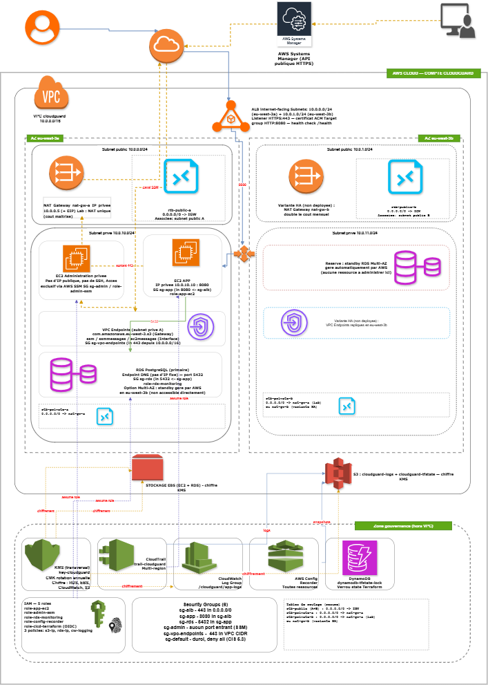

## Architectur



- [Open the full-resolution architecture](architecture/images/architecture-full.png)
- [Download the PDF](architecture/cloudguard-architecture-v3.pdf)
- [Edit the Draw.io source](architecture/cloudguard-architecture-v3.drawio)# 01-terraform-aws

Module d'infrastructure cloud AWS sécurisée avec Terraform.

## Technologies

Terraform, AWS, IAM, S3, VPC, CloudTrail, Checkov.

## Statut

Structure initiale du module.
# CloudGuard

CloudGuard documents the design, deployment and security validation of an AWS infrastructure built entirely with Terraform.

The laboratory reproduces the initial layers of a production-oriented cloud environment where networking, identity management, monitoring and compliance controls are introduced before hosting any application workload.

Every infrastructure component is deployed as code, version controlled and validated before being integrated into the platform.

---

# Engineering Objectives

The project is designed to build a secure AWS foundation capable of supporting future applications while remaining reproducible, auditable and compliant with common cloud security practices.

The implementation progressively introduces identity management, network segmentation, encrypted storage, centralized logging and infrastructure validation to reduce the attack surface from the infrastructure layer.

---

# Laboratory Architecture

The target infrastructure includes:

- **1 AWS Region**
- **1 Virtual Private Cloud (VPC)**
- **2 Availability Zones**
- **4 Subnets (2 Public / 2 Private)**
- **2 Route Tables**
- **1 Internet Gateway**
- **1 NAT Gateway**
- **6 Security Groups**
- **5 IAM Roles**
- **3 IAM Policies**
- **2 EC2 Instances**
- **2 Encrypted Amazon S3 Buckets**
- **1 CloudTrail Trail**
- **1 CloudWatch Log Group**
- **1 KMS Key**
- **1 AWS Config Recorder**
- **25+ Terraform-managed Resources**

The infrastructure is intentionally modular so each component can be deployed, validated and extended independently.

---

# Repository Structure

```
terraform/
├── provider.tf
├── variables.tf
├── main.tf
├── outputs.tf
└── modules/

docs/
```

---

# Security Controls

CloudGuard integrates security controls directly into the infrastructure design.

The laboratory applies:

- least-privilege IAM permissions
- network segmentation across multiple Availability Zones
- restrictive Security Groups
- encrypted object storage
- infrastructure activity logging
- centralized monitoring
- infrastructure compliance verification
- Infrastructure as Code security analysis

Security controls are introduced progressively and validated before additional services are deployed.

---

# Validation Workflow

Every infrastructure iteration follows the same engineering process.

1. Terraform formatting and validation
2. Infrastructure planning
3. Secure resource deployment
4. Static analysis with Checkov
5. Configuration review
6. Functional verification
7. Documentation of security decisions

Each validation stage produces reproducible evidence allowing the environment to be rebuilt and independently verified.

---

# Technical Stack

Infrastructure as Code

- Terraform

Cloud Platform

- AWS

Core Services

- VPC
- EC2
- IAM
- S3
- CloudTrail
- CloudWatch
- AWS Config
- KMS

Security Validation

- Checkov

---

# Skills Developed

This laboratory develops practical experience in:

- AWS Security Architecture
- Infrastructure as Code
- Secure Cloud Networking
- Identity and Access Management
- Infrastructure Compliance
- Cloud Monitoring
- Cloud Logging
- Cloud Security Engineering

---

# Planned Extensions

Future iterations will extend the platform with:

- GuardDuty
- Security Hub
- AWS Inspector
- VPC Flow Logs
- Secrets Manager
- IAM Access Analyzer
- Multi-account architecture
- Automated compliance reporting

Every extension will include architecture updates, implementation notes and validation evidence.

---

# Current Status

The project structure and Terraform foundation have been established.

Infrastructure components are implemented incrementally following the same engineering workflow used throughout the Cyber Platform Lab.

Configuration files, validation reports, architectural decisions and implementation notes will be progressively incorporated as the laboratory evolves.

---

## Author

**Alain SEUGNE**

OSCP • Cloud Security • Infrastructure Security • DevSecOps
