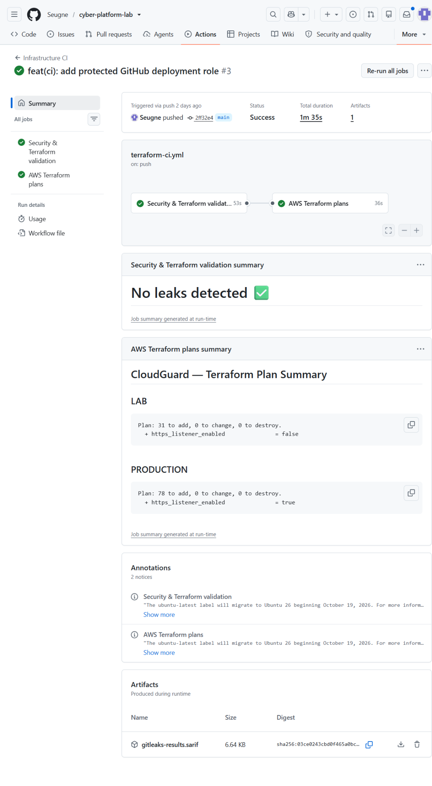
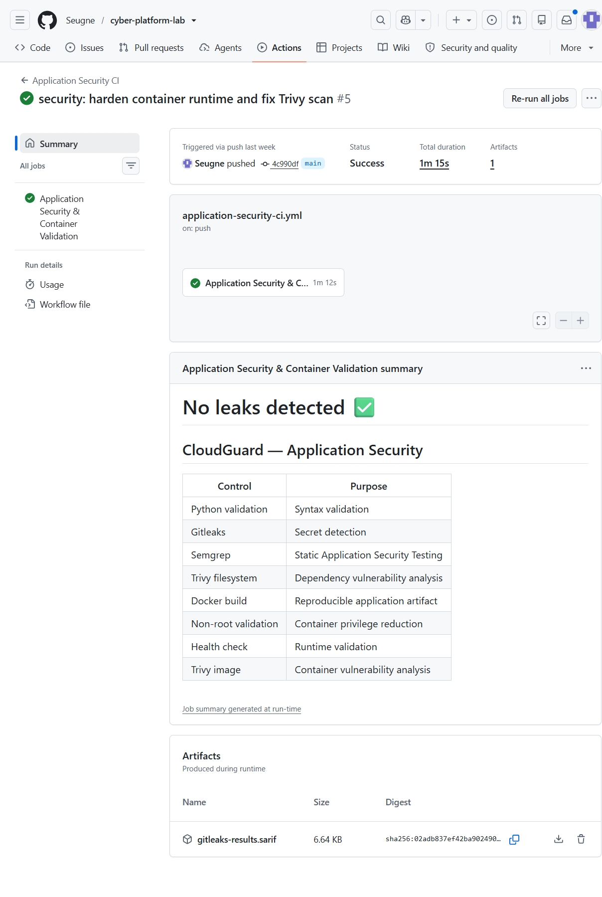
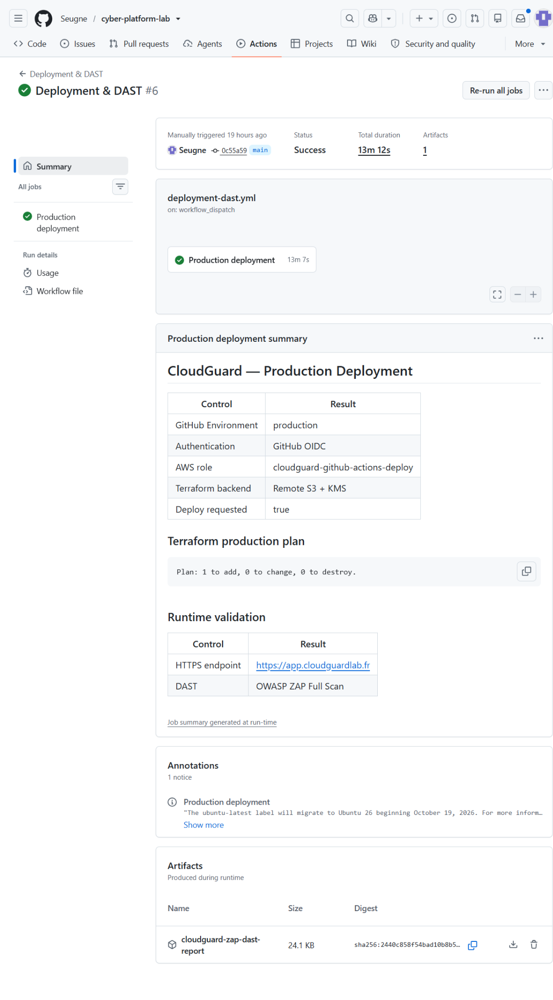
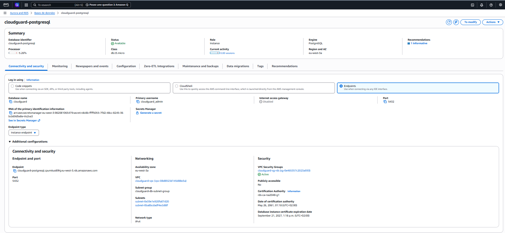
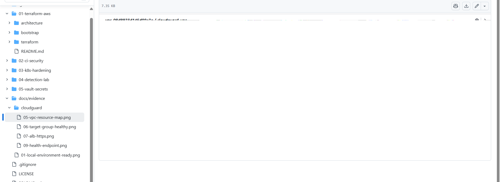
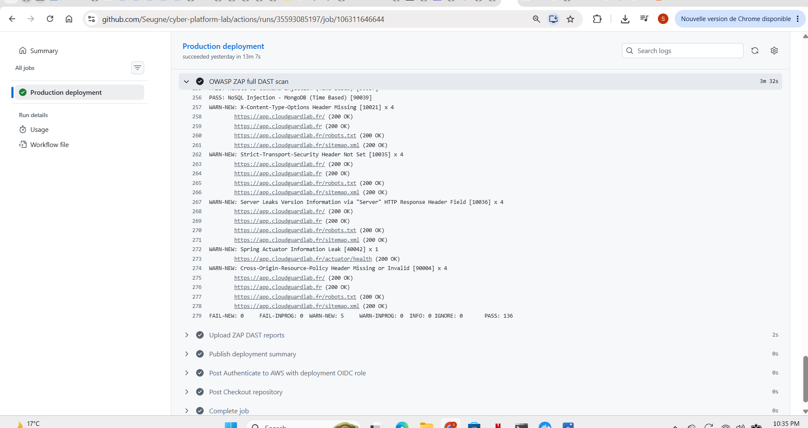

# CloudGuard — Secure AWS Production Platform

CloudGuard is a production-oriented AWS security case study built with **Terraform**, **GitHub Actions** and layered DevSecOps controls.

The project demonstrates the complete path from infrastructure design to production validation:

```text
Terraform
   ↓
Infrastructure CI
   ↓
Application Security CI
   ↓
Protected GitHub deployment
   ↓
AWS production environment
   ↓
HTTPS runtime validation
   ↓
OWASP ZAP DAST
```

The goal is to demonstrate practical Cloud Security and DevSecOps engineering decisions that can be independently reviewed and reproduced.

---

## Executive summary

CloudGuard deploys an AWS environment in `eu-west-3` with:

- 1 VPC (`10.0.0.0/16`);
- 2 Availability Zones;
- 2 public + 2 private subnets;
- Internet Gateway + NAT Gateway;
- S3 gateway endpoint and private SSM-related endpoints;
- 2 private EC2 instances;
- Application Load Balancer exposed only through HTTPS;
- Route 53 DNS + ACM certificate for `app.cloudguardlab.fr`;
- private PostgreSQL RDS;
- KMS encryption;
- CloudTrail, CloudWatch and AWS Config;
- remote Terraform backend in S3 with KMS encryption and locking;
- GitHub OIDC with separate PLAN and DEPLOY IAM roles;
- SAST, secret detection, dependency scanning, image scanning and DAST.

---

## Architecture


- [Open full-resolution architecture](architecture/images/architecture-full.png)
- [Architecture PDF](architecture/cloudguard-architecture-v3.pdf)
- [Draw.io source](architecture/cloudguard-architecture-v3.drawio)

### Deployed VPC


The deployed network separates Internet-facing ingress from private compute and data layers.

```text
Internet
   │
Route 53 / ACM
   │
ALB — HTTPS :443
   │
Target Group
   │
Private App EC2 :8080
   │
Private PostgreSQL RDS :5432

Private Admin EC2
   │
AWS Systems Manager
   │
VPC Endpoints
```

---

## Security architecture

### Identity & CI/CD

- GitHub Actions authenticates to AWS through **OIDC**.
- No long-lived AWS access keys are stored in GitHub.
- A dedicated **PLAN** role performs infrastructure planning.
- A separate **DEPLOY** role is trusted only from the GitHub `production` environment.
- Production deployment is manually triggered and explicitly gated.

### Network security

- Application and administration EC2 instances are private.
- No inbound SSH administration path is required.
- SSM connectivity is provided through private VPC endpoints.
- Security groups implement explicit ALB → app and app → RDS paths.
- RDS is **not publicly accessible**.
- Public ingress terminates on the ALB over HTTPS.

### Encryption & governance

- Terraform remote state uses S3 + KMS + state locking.
- Application audit data uses KMS-backed encryption.
- RDS storage is encrypted.
- CloudTrail, CloudWatch and AWS Config provide governance and audit visibility.

---

## DevSecOps pipelines

CloudGuard uses three complementary GitHub Actions workflows.

### 1. Infrastructure CI



Purpose:

- Terraform format / validation;
- secret scanning;
- Infrastructure as Code security scanning;
- AWS OIDC authentication;
- LAB and PRODUCTION plans;
- no automatic infrastructure apply.

Pre-deployment plans validated:

```text
LAB        31 to add, 0 to change, 0 to destroy
PRODUCTION 78 to add, 0 to change, 0 to destroy
```

The LAB profile intentionally disables the public HTTPS listener while PRODUCTION enables the full ingress path.

### 2. Application Security CI



The application pipeline validates:

| Control | Purpose |
|---|---|
| Python validation | Syntax validation |
| Gitleaks | Secret detection |
| Semgrep | Static Application Security Testing |
| Trivy filesystem | Dependency vulnerability analysis |
| Docker build | Reproducible application artifact |
| Non-root validation | Container privilege reduction |
| Health check | Runtime validation |
| Trivy image | Container vulnerability analysis |

### 3. Production Deployment & DAST



The protected production workflow performs:

1. GitHub OIDC authentication;
2. Terraform initialization against the remote backend;
3. production plan;
4. controlled `terraform apply`;
5. ALB target-health wait;
6. HTTPS health verification;
7. OWASP ZAP Full Scan;
8. ZAP report upload as a workflow artifact.

---

## Runtime validation

### Target Group


The ALB target group routes traffic to the private application instance on **HTTP :8080**. AWS reports:

```text
1 Healthy
0 Unhealthy
```

### HTTPS ingress


The Application Load Balancer is Internet-facing and terminates TLS on:

```text
HTTPS :443
→ cloudguard-app-tg
→ private EC2 :8080
```

The listener uses the ACM certificate for `app.cloudguardlab.fr`.

### Private database



PostgreSQL is deployed in the database subnet group with:

- engine: PostgreSQL;
- instance class: `db.t3.micro`;
- port: `5432`;
- publicly accessible: **No**;
- encrypted storage;
- Secrets Manager-managed master credentials;
- enhanced monitoring.

### Application health



The public HTTPS endpoint reaches the private application instance successfully:

```json
{
  "status": "healthy",
  "service": "cloudguard-app"
}
```

---

## DAST evidence



The live production endpoint was scanned with OWASP ZAP after deployment.

```text
FAIL-NEW: 0
FAIL-INPROG: 0
WARN-NEW: 5
WARN-INPROG: 0
INFO: 0
IGNORE: 0
PASS: 136
```

Representative warnings:

- `X-Content-Type-Options` header missing;
- HSTS header not set;
- server version information exposure;
- Spring Actuator information exposure;
- Cross-Origin-Resource-Policy header missing or invalid.

These findings are documented as remediation work rather than removed from the evidence.

---

## Repository layout

```text
01-terraform-aws/
├── bootstrap/
│   ├── backend/
│   ├── dns/
│   └── github-oidc/
├── architecture/
└── terraform/
    ├── environments/
    │   ├── lab.tfvars
    │   └── production.tfvars
    └── *.tf

02-ci-security/
├── app/
├── Dockerfile
└── requirements.txt

.github/workflows/
├── terraform-ci.yml
├── application-security-ci.yml
└── deployment-dast.yml
```

---

## Reproducibility and cost control

The persistent foundation is deliberately separated from the disposable production stack:

**Persistent**

- Terraform state backend;
- Route 53 hosted zone;
- GitHub OIDC bootstrap.

**Recreatable**

- application VPC;
- ALB;
- EC2;
- RDS;
- NAT Gateway;
- VPC endpoints;
- audit / governance resources.

This allows the production lab to be deployed for validation and then removed to control AWS costs.

---

## What this project demonstrates

- AWS network architecture and segmentation;
- Terraform state and lifecycle management;
- IAM and workload identity federation;
- secure CI/CD design;
- container hardening;
- SAST / secrets / dependency / image scanning;
- TLS and load balancing;
- private database design;
- AWS governance services;
- post-deployment DAST;
- security finding documentation and remediation workflow.

---

## Author

**Alain SEUGNE**

Cloud Security • DevSecOps • Infrastructure Security
