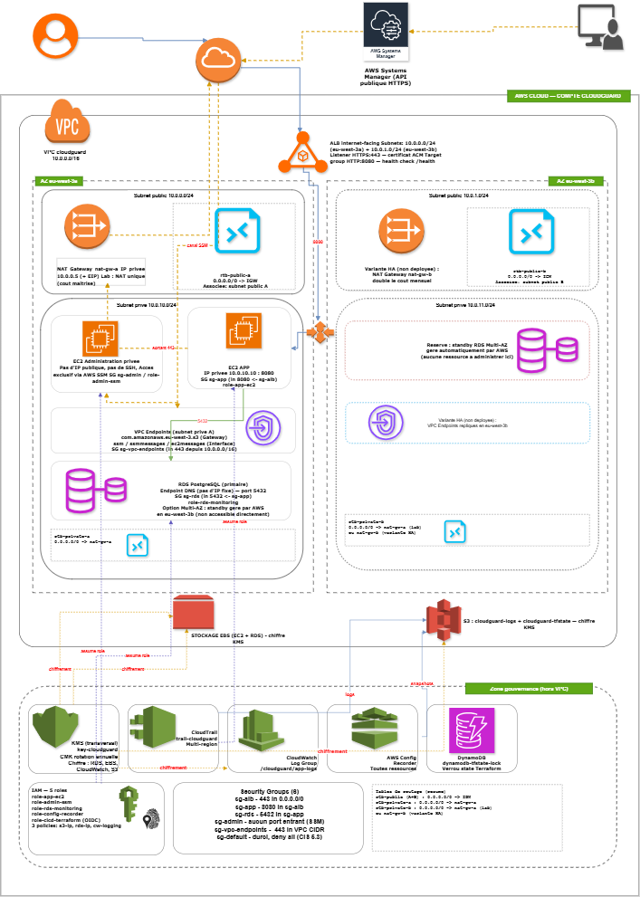
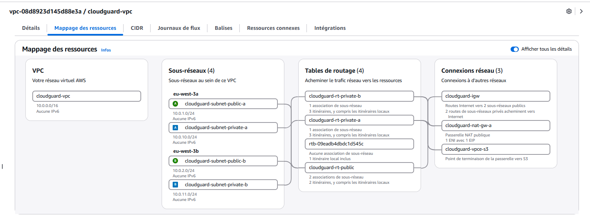

# Cyber Platform Lab

> **Security engineering portfolio focused on Cloud Security, DevSecOps, Kubernetes Security, Detection Engineering and Secrets Management.**

This repository is structured as a set of hands-on engineering case studies. The goal is not to collect isolated demos, but to show how I design, secure, automate, validate and document infrastructure so another engineer can review the decisions and evidence.

<p align="center">
  <a href="01-terraform-aws/architecture/images/architecture-full.png">
    
  </a>
</p>

> **Current flagship project:** CloudGuard — an end-to-end AWS / Terraform / DevSecOps case study. The remaining modules extend the same portfolio into Kubernetes hardening, detection engineering and secrets management.

## Featured case study — CloudGuard

**CloudGuard** is a production-oriented AWS security lab built with Terraform and GitHub Actions.

It combines:

- segmented AWS networking across two Availability Zones;
- private application and administration EC2 instances;
- an internet-facing Application Load Balancer with **HTTPS :443**;
- a private PostgreSQL RDS database;
- AWS Systems Manager connectivity through VPC endpoints;
- encryption with KMS;
- CloudTrail, CloudWatch and AWS Config;
- remote Terraform state in S3 with KMS encryption and state locking;
- GitHub OIDC federation instead of long-lived AWS credentials;
- Infrastructure as Code security checks;
- application, dependency and container security scans;
- controlled production deployment;
- post-deployment OWASP ZAP DAST.

### What was validated

| Control | Result |
|---|---|
| Infrastructure CI | Terraform validation + security checks + LAB/PRODUCTION plans |
| Secret detection | Gitleaks — no leaks detected |
| SAST | Semgrep |
| Dependency / filesystem scan | Trivy |
| Container hardening | non-root runtime + image scan |
| AWS authentication | GitHub OIDC with separate PLAN and DEPLOY roles |
| Production delivery | GitHub `production` environment + explicit manual deploy input |
| Runtime health | ALB target healthy + HTTPS health endpoint |
| DAST | OWASP ZAP Full Scan |
| ZAP result | **136 PASS / 5 WARN / 0 FAIL** |

### Evidence at a glance

<p align="center">
  <a href="screenshots/05-vpc-resource-map.png">
    
  </a>
  <a href="screenshots/09-health-endpoint.png">
    
  </a>
</p>

The screenshots are supporting evidence only. The implementation is reviewable in Terraform, GitHub Actions and application code.

**→ [Open the full CloudGuard technical case study](01-terraform-aws/README.md)**

---

## Engineering workflow

```text
Design
  ↓
Infrastructure as Code
  ↓
Static security validation
  ↓
Application & container security
  ↓
Controlled deployment
  ↓
Runtime health verification
  ↓
Dynamic security testing
  ↓
Evidence & remediation
```

Security checks are treated as deployment controls rather than documentation-only exercises.

---

## Repository roadmap

| Module | Focus | Status |
|---|---|---|
| [01-terraform-aws](01-terraform-aws/) | AWS Cloud Security / Terraform | **Implemented & validated** |
| [02-ci-security](02-ci-security/) | DevSecOps / AppSec / Container Security | **Implemented & integrated** |
| [03-k8s-hardening](03-k8s-hardening/) | Kubernetes hardening | Portfolio module |
| [04-detection-lab](04-detection-lab/) | Detection engineering / SOC | Portfolio module |
| [05-vault-secrets](05-vault-secrets/) | Secrets management / Vault | Portfolio module |

---

## Technology stack

**Cloud & IaC:** AWS, Terraform  
**CI/CD:** GitHub Actions  
**Application:** Python, Flask, Gunicorn  
**Containers:** Docker  
**Security:** Gitleaks, Semgrep, Trivy, OWASP ZAP  
**AWS Security & Governance:** IAM, KMS, CloudTrail, CloudWatch, AWS Config, SSM  
**Data:** Amazon RDS PostgreSQL  
**Networking:** VPC, ALB, NAT Gateway, Route 53, ACM, VPC Endpoints

---

## Key engineering decisions

- **No static AWS keys in GitHub Actions:** workloads assume IAM roles through GitHub OIDC.
- **PLAN and DEPLOY are separated:** planning permissions are distinct from production deployment permissions.
- **Private workloads:** application, administration and database layers are not directly exposed to the Internet.
- **TLS termination at the ALB:** public traffic reaches `app.cloudguardlab.fr` over HTTPS.
- **Private database:** PostgreSQL RDS is not publicly accessible.
- **Remote Terraform state:** S3 + KMS + locking are kept outside the disposable application stack.
- **Security gates before and after deployment:** static controls run before delivery; the deployment workflow rejects unexpected Terraform changes/destructions; ZAP validates the live HTTPS endpoint afterward.
- **Evidence-driven validation:** CI summaries, AWS state and security scan artifacts are retained as implementation evidence.

---

## Reviewer path

A recruiter or engineer can review this repository in three passes:

1. **30 seconds:** read the featured case study and validated controls;
2. **2–3 minutes:** open the CloudGuard case study and deployment evidence;
3. **deep dive:** inspect Terraform, GitHub Actions and application/container code.

---

## Security findings

The production DAST run completed with:

```text
FAIL-NEW: 0
WARN-NEW: 5
PASS: 136
```

The remaining warnings are treated as remediation items, not hidden results. They include missing security headers and server-information exposure. This keeps the engineering loop explicit: **deploy → test → identify findings → remediate**.

---

## Author

**Alain SEUGNE**

Cloud Security • DevSecOps • Infrastructure Security • Detection Engineering • Security Operations
